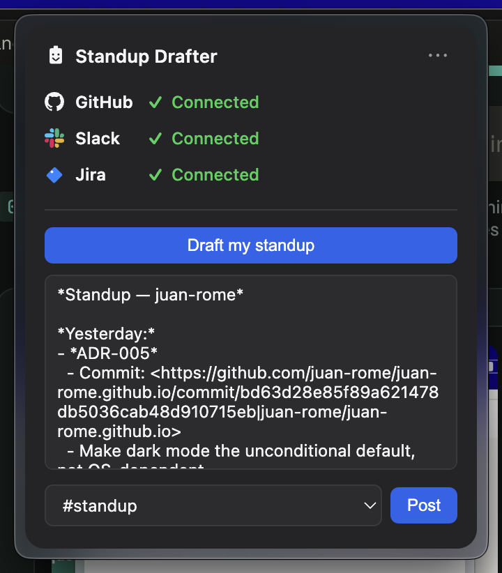
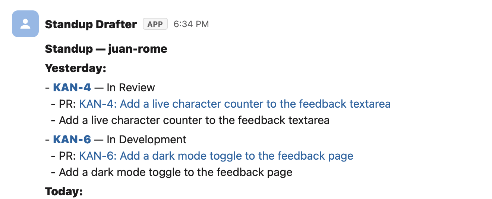

# Standup Drafter

[](https://github.com/juan-rome/standup-drafter/actions/workflows/ci.yml)

A macOS menu bar app that pulls your GitHub activity from the previous day
(PRs opened, reviews given, commits), groups it by Jira ticket where a ticket
key is detectable, optionally enriches those tickets with their live Jira
status, drafts a standup message, and posts it to a Slack channel after you
review/edit it — all from a small popover under a tray icon, no full window
required.

<p align="center">
  
</p>

<p align="center">
  
</p>

## Setup

### 1. GitHub OAuth App (Device Flow)

1. Go to https://github.com/settings/developers → **New OAuth App**.
2. Fill in any name/homepage URL/callback URL (callback URL is unused by
   Device Flow but required by the form — any valid URL works).
3. After creating it, open **Device Flow** and enable it.
4. Copy the **Client ID** into `src/lib/config.js`, or set it as an env var:
   ```bash
   export GITHUB_CLIENT_ID=your_client_id
   ```

### 2. Slack App

1. Go to https://api.slack.com/apps → **Create New App** → From scratch.
2. Under **OAuth & Permissions**, add these Bot Token Scopes:
   - `chat:write`
   - `channels:read`
3. Install the app to your workspace.
4. Copy the **Bot User OAuth Token** (starts with `xoxb-`) — you'll paste this
   into the app when connecting Slack.
5. Invite the bot to whichever channel(s) you want to post standups to
   (`/invite @Standup Drafter` in Slack).

### 3. Jira (optional)

Only needed if you want live ticket status/summary shown next to each
grouped ticket. Without it, tickets are still detected and grouped from
GitHub PR/commit text — you just won't see their current status.

1. Go to https://id.atlassian.com/manage-profile/security/api-tokens →
   **Create API token**.
2. In the app, click **Connect** next to Jira and fill in:
   - Your Jira site (e.g. `yourteam.atlassian.net`)
   - The email address on your Atlassian account
   - The API token you just created

### 4. Run it

```bash
npm install
npm start
```

### 5. Build a distributable .dmg

```bash
npm run dist
```

The unsigned `.dmg` will be in `dist/`. Since it's unsigned, macOS Gatekeeper
will show a warning on first open — right-click the app → Open to bypass it,
or System Settings → Privacy & Security → "Open Anyway".

### 6. Run the tests

```bash
npm test
```

Uses Node's built-in test runner (`node --test`) — no test framework
dependency. The parsing/formatting logic (`draftStandup`, `parseActivity`,
`extractTicketKeys`, `parseTicketStatuses`, `filterMemberChannels`,
`startOfYesterdayISO`) is factored out as pure functions specifically so it
can be tested without an Electron runtime or network access; see
[Design decisions](#design-decisions) below.

## How credentials are stored

The GitHub token, Slack token, and Jira credentials (site URL, email, API
token) are encrypted at rest using Electron's `safeStorage` API (OS
keychain-backed) and stored in the app's local user data directory. Nothing
is sent anywhere except GitHub's, Slack's, and Jira's own APIs.

## Design decisions

A few choices here trade off against "more correct" alternatives on purpose,
given this is a single-user personal tool, not a multi-tenant product:

- **GitHub Device Flow instead of a full OAuth redirect.** Device Flow needs
  only a public Client ID (no client secret, no backend redirect server),
  which matters because this app is a static, unsigned binary handed out to
  whoever asks for it — there's no server to keep a secret on. The
  tradeoff: users have to copy a code into a browser tab rather than a
  single-click "Sign in" button.
- **Slack via a pasted bot token, not OAuth.** A full "Sign in with Slack"
  flow needs a client secret and a local loopback redirect server. For a
  tool only ever installed by hand at the developer's request, asking the
  user to generate a token in their own Slack app (scoped to just
  `chat:write` + `channels:read`) is simpler and keeps no secret embedded in
  the shipped app at all. This wouldn't scale to a multi-user product —
  that would need real OAuth.
- **No code signing / notarization.** Distributing wasn't the goal — a demo
  video is. The app is handed out only on request, so an unsigned `.dmg`
  (with the one-time Gatekeeper right-click-to-open step) avoids the $99/yr
  Apple Developer cost for a tool with a handful of installs.
- **Pure functions pulled out of the I/O layer.** `github.js` and `slack.js`
  talk to `safeStorage`/`fetch` directly, which makes them awkward to unit
  test (they need a real Electron runtime). The actual logic worth testing —
  turning API responses into the activity summary, formatting the standup
  text, filtering joined channels — is factored into plain functions with no
  side effects, so `npm test` runs in plain Node with zero mocking of
  Electron internals.
- **Ticket detection from GitHub text, not a required Jira dependency.**
  Grouping PRs/commits by Jira ticket key works entirely from text already
  fetched from GitHub (title, PR description, commit message) via a regex —
  Jira is only needed for the extra step of showing that ticket's *live
  status* (e.g. "In QA"). This means the grouping feature works with zero
  extra auth, and Jira integration is additive/optional rather than a hard
  dependency for a core feature.
- **Jira via a pasted API token, not OAuth.** Same reasoning as the Slack
  token: Atlassian's OAuth (3LO) needs a registered app and a local redirect
  server to catch the callback. A personal API token (Basic auth with
  email + token, the standard way to hit Jira Cloud's REST API
  programmatically) skips all of that for a tool that's never going to be a
  multi-tenant product.
- **A hand-rendered tray icon instead of a static asset.** The icon is
  generated from a small signed-distance-field script
  ([scripts/generate-tray-icon.js](scripts/generate-tray-icon.js)) rather
  than exported from a design tool, so it's reproducible and easy to tweak
  without needing image-editing software — trading a bit of upfront code for
  a design asset that's diffable and regeneratable like everything else in
  the repo.
